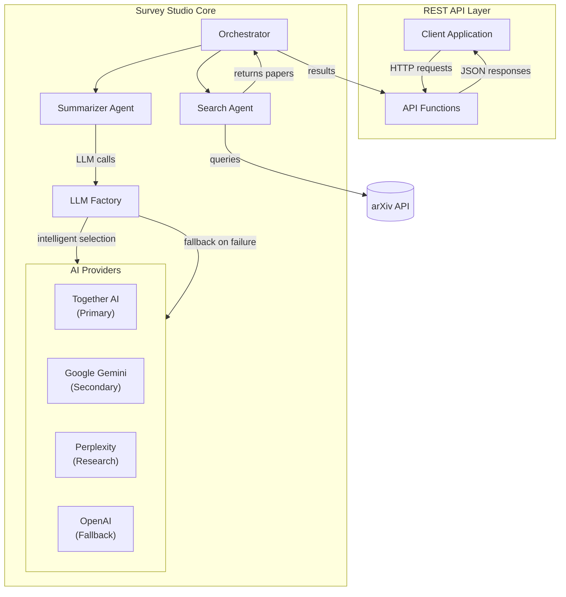

# Survey Studio 📚

A multi-agent literature review assistant powered by AutoGen. Survey Studio uses AI agents to automatically search arXiv, analyze research papers, and generate comprehensive literature reviews through a clean REST API.

[](https://www.python.org/downloads/release/python-31211/)
[](https://python-poetry.org/)
[](https://docs.astral.sh/ruff/)
[](https://github.com/microsoft/pyright)
[](https://github.com/Aditya-gam/survey-studio/actions)
[](LICENSE)
[](https://commitizen-tools.github.io/commitizen/)

## 🌟 Features

- **Multi-Agent System**: Two specialized AI agents work together:
  - **Search Agent** 🔍: Crafts optimized arXiv queries and retrieves relevant papers
  - **Summarizer Agent** 📝: Generates structured literature reviews with key insights
- **Multi-Provider AI Support**: Intelligent fallback across 4 AI providers:
  - **Together AI** - Cost-effective with generous free tier
  - **Google Gemini** - Fast and capable for complex analysis
  - **Perplexity** - Research-focused with web access
  - **OpenAI** - Reliable fallback with consistent performance
- **Cost Optimization**: Automatic provider selection based on cost efficiency and availability
- **Usage Monitoring**: Track API usage, costs, and performance across all providers
- **REST API**: Clean, well-documented API functions for building custom interfaces
- **arXiv Integration**: Direct access to the world's largest repository of academic papers
- **Configurable**: Adjustable number of papers, AI models, and search parameters
- **Export Support**: Generate Markdown and HTML reports
- **Professional Development Setup**: Full CI/CD pipeline with linting and type checking

## 🧭 Architecture



- **REST API Layer**: Provides clean functions for building custom interfaces
- **Search Agent**: Generates and executes arXiv queries
- **Summarizer Agent**: Produces structured review using AI models
- **LLM Factory**: Intelligently selects and manages AI providers with fallback
- **Orchestrator**: Manages the multi-agent loop and data flow

## 🚀 Quick Start

### Prerequisites

- Python 3.12.11+
- Poetry (for dependency management)
- At least one AI provider API key

### Installation

1. **Clone the repository:**
   ```bash
   git clone https://github.com/Aditya-gam/survey-studio.git
   cd survey-studio
   ```

2. **Install dependencies with Poetry:**
   ```bash
   poetry install
   ```

3. **Set up environment variables:**

   **Option A: Using .env file (Recommended for local development):**
   ```bash
   # Copy the template and add your API key
   cp .env.example .env
   # Edit .env and add your actual API key
   ```

   **Option B: Using environment variable:**
   ```bash
   export OPENAI_API_KEY="your-openai-api-key-here"
   ```

## 🌐 REST API

Survey Studio provides a comprehensive REST API that enables developers to integrate literature review capabilities into their applications. The API follows modern REST principles and includes complete OpenAPI/Swagger documentation.

### Quick Start Workflow

Follow this complete workflow to get started with the Survey Studio API:

#### 1. Start the Development Server

```bash
poetry run dev
```

The server will start on `localhost:8000` with hot reload enabled for development.

#### 2. Verify Server Health

Check that everything is working correctly:

```bash
curl -X GET "localhost:8000/health"
```

**Expected Response:**
```json
{
  "status": "healthy",
  "providers": {
    "available_count": 1,
    "best_provider": "together-ai",
    "providers": [
      {
        "name": "together-ai",
        "model": "meta-llama/Llama-3.1-70B-Instruct-Turbo",
        "priority": 1,
        "free_tier_rpm": 30,
        "free_tier_tpm": 200000
      }
    ]
  },
  "timestamp": "2025-01-20T10:30:45.123456",
  "version": "0.1.0"
}
```

#### 3. (Optional) Validate Review Parameters

Before running a full review, you can validate your parameters:

```bash
curl -X POST "localhost:8000/api/v1/validate" \
  -H "Content-Type: application/json" \
  -d '{
    "topic": "retrieval augmented generation",
    "num_papers": 5,
    "model": "auto"
  }'
```

**Expected Response:**
```json
{
  "status": "completed",
  "results": {
    "valid": true,
    "message": "Parameters are valid",
    "topic": "retrieval augmented generation",
    "num_papers": 5,
    "model": "auto"
  }
}
```

#### 4. Run Literature Review

Execute a complete literature review:

```bash
curl -X POST "localhost:8000/api/v1/reviews" \
  -H "Content-Type: application/json" \
  -d '{
    "topic": "retrieval augmented generation",
    "num_papers": 5,
    "model": "auto"
  }'
```

**Expected Response:**
```json
{
  "status": "completed",
  "results": [
    "# Literature Review: Retrieval Augmented Generation\n\n## Overview\nRetrieval-Augmented Generation (RAG) represents a significant advancement...",
    "## Key Findings\n1. RAG systems demonstrate superior performance in knowledge-intensive tasks...",
    "## Paper Analysis\n### Paper 1: 'Retrieval-Augmented Generation for Knowledge-Intensive NLP Tasks'\n- **Authors**: Lewis et al.\n- **Summary**: This foundational work introduces..."
  ]
}
```

#### 5. Export Results

Generate formatted exports of your review results:

```bash
curl -X POST "localhost:8000/api/v1/export" \
  -H "Content-Type: application/json" \
  -d '{
    "topic": "retrieval augmented generation",
    "results_frames": [
      "# Literature Review: Retrieval Augmented Generation...",
      "## Key Findings...",
      "## Paper Analysis..."
    ],
    "num_papers": 5,
    "model": "auto",
    "session_id": "session_12345",
    "format_type": "markdown"
  }'
```

**Expected Response:**
```json
{
  "content": "# Survey Studio Literature Review\n\n**Topic**: Retrieval Augmented Generation...",
  "filename": "literature_review_retrieval_augmented_generation_20250120_103045.md",
  "mime_type": "text/markdown",
  "format": "markdown",
  "metadata": {
    "topic": "retrieval augmented generation",
    "num_papers": 5,
    "model": "auto",
    "session_id": "session_12345",
    "generated_at": "2025-01-20T10:30:45.123456"
  }
}
```

### API Endpoints Reference

| Method | Endpoint | Description |
|--------|----------|-------------|
| `GET` | `/health` | Service health check with provider status |
| `GET` | `/` | Basic service information |
| `GET` | `/providers` | Detailed AI provider configuration |
| `GET` | `/models` | Available AI models by provider |
| `POST` | `/api/v1/validate` | Validate review parameters (optional) |
| `POST` | `/api/v1/reviews` | Execute literature review |
| `POST` | `/api/v1/export` | Export review results to various formats |

### Request/Response Schemas

#### Review Request
```json
{
  "topic": "string (1-500 characters)",
  "num_papers": "integer (1-50)",
  "model": "string ('auto' for automatic selection)"
}
```

#### Export Request
```json
{
  "topic": "string",
  "results_frames": ["array of strings"],
  "num_papers": "integer",
  "model": "string",
  "session_id": "string",
  "format_type": "string ('markdown' or 'html', default: 'markdown')"
}
```

### Complete API Documentation

For detailed API specifications, request/response schemas, and interactive testing:

**Visit: http://localhost:8000/docs** (when server is running)

This provides the full OpenAPI/Swagger documentation with:
- Complete endpoint specifications
- Request/response examples
- Interactive API testing interface
- Model schemas and validation rules

### Quick Verification

To confirm everything is working after setup:

1. **Server Started Successfully**: Look for `INFO: Uvicorn running on http://0.0.0.0:8000`
2. **Health Check Passes**: `curl localhost:8000/health` returns `"status": "healthy"`
3. **API Documentation Accessible**: Visit `http://localhost:8000/docs` in your browser

## 🔧 Configuration

### AI Provider Configuration

Survey Studio supports multiple AI providers with intelligent fallback and cost optimization:

**Supported Providers (in priority order):**
1. **Together AI** - Best free tier, cost-effective for general tasks
2. **Google Gemini** - Fast and capable for complex analysis
3. **Perplexity** - Best for research with web access capabilities
4. **OpenAI** - Reliable fallback with consistent performance

**Required API Keys (at least one):**
- `TOGETHER_AI_API_KEY` - Get from [Together AI](https://api.together.xyz/settings/api-keys)
- `GEMINI_API_KEY` - Get from [Google AI Studio](https://aistudio.google.com/app/apikey)
- `PERPLEXITY_API_KEY` - Get from [Perplexity](https://www.perplexity.ai/settings/api)
- `OPENAI_API_KEY` - Get from [OpenAI Platform](https://platform.openai.com/api-keys)

**Optional Model Overrides:**
- `TOGETHER_AI_MODEL` - e.g., `meta-llama/Llama-3.1-70B-Instruct-Turbo`
- `GEMINI_MODEL` - e.g., `gemini-2.5-flash` or `gemini-1.5-pro`
- `PERPLEXITY_MODEL` - e.g., `llama-3.1-sonar-huge-128k-online`
- `OPENAI_MODEL` - e.g., `gpt-4o`

## 🛠 Development Setup

### Initial Setup

1. **Install Poetry** (if not already installed):
   ```bash
   curl -sSL https://install.python-poetry.org | python3 -
   ```

2. **Clone and install dependencies:**
   ```bash
   git clone https://github.com/Aditya-gam/survey-studio.git
   cd survey-studio
   poetry install
   ```

3. **Install pre-commit hooks:**
   ```bash
   poetry run pre-commit install
   ```

### Development Workflow

1. **No venv activation required (use Poetry runner):**
   ```bash
   # Prefer prefixing commands with 'poetry run'
   poetry run <command>
   ```

2. **Run linting and formatting:**
   ```bash
   poetry run ruff check .
   poetry run ruff format .
   ```

3. **Type checking:**
   ```bash
   poetry run pyright
   ```

4. **Pre-commit: run the full code quality pipeline locally:**
   ```bash
   poetry run pre-commit run --all-files
   ```

### Code Quality Pipeline

The project enforces 100% compliance via Ruff, Pyright, detect-secrets, and commit message validation.

- **Ruff formatting**: opinionated code formatting. Imports sorted with isort profile.
- **Ruff linting**: rule sets enabled: E,W,F,I,B,C4,UP,N,SIM,TCH,ARG,PIE,PT,RET,SLF,TID,ERA,PL.
- **Type checking (Pyright)**: strict configuration; comprehensive type checking with Microsoft's Pyright.
- **Secrets scanning**: `detect-secrets` with a committed baseline.
- **Commit messages**: Conventional Commits validated by Commitizen.
- **Poetry checks**: validates project metadata and lock consistency.

### Project Structure

```
survey-studio/
├── src/
│   └── survey_studio/
│       ├── __init__.py          # Package initialization
│       ├── app.py              # Main module (redirects to API)
│       ├── api.py              # REST API functions
│       ├── backend.py          # AutoGen multi-agent backend
│       ├── config.py           # Configuration management
│       ├── export.py           # Export functionality
│       ├── orchestrator.py     # Main orchestrator
│       └── validation.py       # Input validation
├── .github/
│   └── workflows/             # CI/CD workflows
├── pyproject.toml             # Poetry configuration
├── .pre-commit-config.yaml    # Pre-commit hooks
├── .gitignore                 # Git ignore rules
├── CHANGELOG.md               # Project changelog
└── README.md                  # This file
```

## 📊 Technology Stack

- **Backend**: AutoGen (multi-agent framework)
- **API**: FastAPI, Pydantic, Uvicorn
- **Data Source**: arXiv API
- **AI Models**: Multiple providers with intelligent fallback
- **Development**: Poetry, Ruff, Pyright
- **CI/CD**: Pre-commit hooks, GitHub Actions

## 📄 License

This project is licensed under the MIT License - see the [LICENSE](LICENSE) file for details.

## 🙏 Acknowledgments

- [AutoGen](https://github.com/microsoft/autogen) for the multi-agent framework
- [FastAPI](https://fastapi.tiangolo.com/) for the API framework
- [arXiv](https://arxiv.org/) for providing access to academic papers
- [OpenAI](https://openai.com/) and other AI providers for the language models

## 📞 Support

If you have questions or need help:

1. Check the [documentation](https://github.com/Aditya-gam/survey-studio/wiki)
2. Search [existing issues](https://github.com/Aditya-gam/survey-studio/issues)
3. Create a [new issue](https://github.com/Aditya-gam/survey-studio/issues/new)

---

**Survey Studio** - Accelerating research through AI-powered literature reviews ✨
