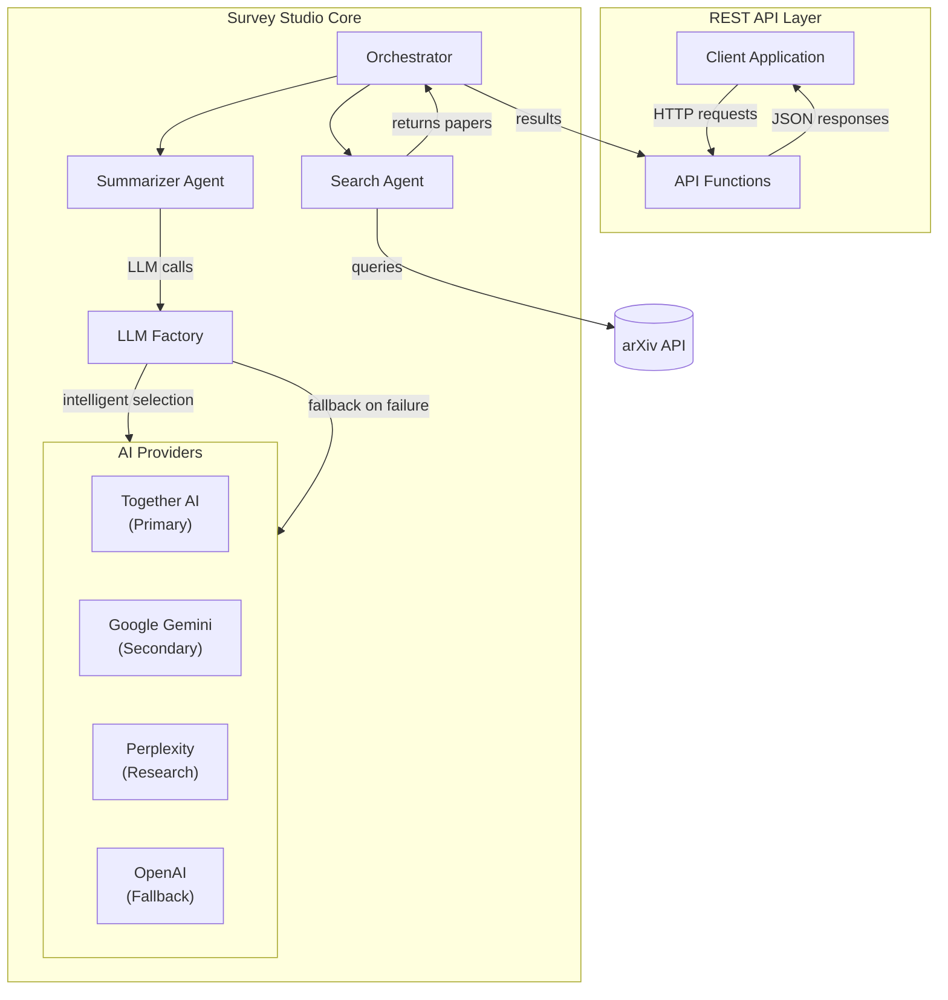

# Survey Studio 📚

A multi-agent literature review assistant powered by AutoGen. Survey Studio uses AI agents to automatically search arXiv, analyze research papers, and generate comprehensive literature reviews through a clean REST API.

[](https://www.python.org/downloads/release/python-31211/)
[](https://python-poetry.org/)
[](https://docs.astral.sh/ruff/)
[](https://github.com/microsoft/pyright)
[](https://github.com/Aditya-gam/survey-studio/actions)
[](LICENSE)
[](https://commitizen-tools.github.io/commitizen/)

## 🌟 Features

- **Multi-Agent System**: Two specialized AI agents work together:
  - **Search Agent** 🔍: Crafts optimized arXiv queries and retrieves relevant papers
  - **Summarizer Agent** 📝: Generates structured literature reviews with key insights
- **Multi-Provider AI Support**: Intelligent fallback across 4 AI providers:
  - **Together AI** - Cost-effective with generous free tier
  - **Google Gemini** - Fast and capable for complex analysis
  - **Perplexity** - Research-focused with web access
  - **OpenAI** - Reliable fallback with consistent performance
- **Cost Optimization**: Automatic provider selection based on cost efficiency and availability
- **Usage Monitoring**: Track API usage, costs, and performance across all providers
- **REST API**: Clean, well-documented API functions for building custom interfaces
- **arXiv Integration**: Direct access to the world's largest repository of academic papers
- **Configurable**: Adjustable number of papers, AI models, and search parameters
- **Export Support**: Generate Markdown and HTML reports
- **Professional Development Setup**: Full CI/CD pipeline with linting and type checking

## 🧭 Architecture



- **REST API Layer**: Provides clean functions for building custom interfaces
- **Search Agent**: Generates and executes arXiv queries
- **Summarizer Agent**: Produces structured review using AI models
- **LLM Factory**: Intelligently selects and manages AI providers with fallback
- **Orchestrator**: Manages the multi-agent loop and data flow

## 🚀 Quick Start

### Prerequisites

- Python 3.12.11+
- Poetry (for dependency management)
- At least one AI provider API key

### Installation

1. **Clone the repository:**
   ```bash
   git clone https://github.com/Aditya-gam/survey-studio.git
   cd survey-studio
   ```

2. **Install dependencies with Poetry:**
   ```bash
   poetry install
   ```

3. **Set up environment variables:**

   **Option A: Using .env file (Recommended for local development):**
   ```bash
   # Copy the template and add your API key
   cp .env.example .env
   # Edit .env and add your actual API key
   ```

   **Option B: Using environment variable:**
   ```bash
   export OPENAI_API_KEY="your-openai-api-key-here"
   ```

## 📖 API Functions

The core functionality is provided through clean, reusable functions in `survey_studio.api`:

### Core Functions

- **`initialize_session()`** - Initialize a new review session
- **`get_provider_status()`** - Get AI provider configuration status
- **`validate_review_request(topic, num_papers, model)`** - Validate review parameters
- **`run_literature_review(topic, num_papers, model, session_id)`** - Run async literature review
- **`run_review_with_fallback(topic, num_papers, model, session_id)`** - Run sync literature review
- **`generate_export(request)`** - Generate exports using ExportRequestRequired dict
- **`get_available_models()`** - Get available AI models by provider
- **`get_health_status()`** - Get service health status

### Example Usage

```python
from survey_studio.api import (
    initialize_session,
    validate_review_request,
    run_review_with_fallback,
    generate_export
)

# Initialize session
session_id = initialize_session()

# Validate request
validation = validate_review_request(
    topic="transformer architectures",
    num_papers=5,
    model="auto"
)

if validation["valid"]:
    # Run literature review
    results = run_review_with_fallback(
        topic="transformer architectures",
        num_papers=5,
        model="auto",
        session_id=session_id
    )

    # Generate export
    export = generate_export({
        "topic": "transformer architectures",
        "results_frames": results["results"],
        "num_papers": 5,
        "model": "auto",
        "session_id": session_id,
        "format_type": "markdown"
    })

    print(f"Review completed: {export['filename']}")
```

### Building REST Endpoints

Use these functions to build your own REST API endpoints:

```python
from fastapi import FastAPI, HTTPException
from survey_studio.api import (
    initialize_session,
    validate_review_request,
    run_review_with_fallback,
    get_health_status
)

app = FastAPI()

@app.get("/health")
async def health_check():
    return get_health_status()

@app.post("/review")
async def create_review(request: ReviewRequest):
    # Validate request
    validation = validate_review_request(
        request.topic, request.num_papers, request.model
    )

    if not validation["valid"]:
        raise HTTPException(status_code=400, detail=validation["error"])

    # Run review
    session_id = initialize_session()
    results = run_review_with_fallback(
        request.topic, request.num_papers, request.model, session_id
    )

    return results
```

## 🔧 Configuration

### AI Provider Configuration

Survey Studio supports multiple AI providers with intelligent fallback and cost optimization:

**Supported Providers (in priority order):**
1. **Together AI** - Best free tier, cost-effective for general tasks
2. **Google Gemini** - Fast and capable for complex analysis
3. **Perplexity** - Best for research with web access capabilities
4. **OpenAI** - Reliable fallback with consistent performance

**Required API Keys (at least one):**
- `TOGETHER_AI_API_KEY` - Get from [Together AI](https://api.together.xyz/settings/api-keys)
- `GEMINI_API_KEY` - Get from [Google AI Studio](https://aistudio.google.com/app/apikey)
- `PERPLEXITY_API_KEY` - Get from [Perplexity](https://www.perplexity.ai/settings/api)
- `OPENAI_API_KEY` - Get from [OpenAI Platform](https://platform.openai.com/api-keys)

**Optional Model Overrides:**
- `TOGETHER_AI_MODEL` - e.g., `meta-llama/Llama-3.1-70B-Instruct-Turbo`
- `GEMINI_MODEL` - e.g., `gemini-2.5-flash` or `gemini-1.5-pro`
- `PERPLEXITY_MODEL` - e.g., `llama-3.1-sonar-huge-128k-online`
- `OPENAI_MODEL` - e.g., `gpt-4o`

## 🛠 Development Setup

### Initial Setup

1. **Install Poetry** (if not already installed):
   ```bash
   curl -sSL https://install.python-poetry.org | python3 -
   ```

2. **Clone and install dependencies:**
   ```bash
   git clone https://github.com/Aditya-gam/survey-studio.git
   cd survey-studio
   poetry install
   ```

3. **Install pre-commit hooks:**
   ```bash
   poetry run pre-commit install
   ```

### Development Workflow

1. **No venv activation required (use Poetry runner):**
   ```bash
   # Prefer prefixing commands with 'poetry run'
   poetry run <command>
   ```

2. **Run linting and formatting:**
   ```bash
   poetry run ruff check .
   poetry run ruff format .
   ```

3. **Type checking:**
   ```bash
   poetry run pyright
   ```

4. **Pre-commit: run the full code quality pipeline locally:**
   ```bash
   poetry run pre-commit run --all-files
   ```

### Code Quality Pipeline

The project enforces 100% compliance via Ruff, Pyright, detect-secrets, and commit message validation.

- **Ruff formatting**: opinionated code formatting. Imports sorted with isort profile.
- **Ruff linting**: rule sets enabled: E,W,F,I,B,C4,UP,N,SIM,TCH,ARG,PIE,PT,RET,SLF,TID,ERA,PL.
- **Type checking (Pyright)**: strict configuration; comprehensive type checking with Microsoft's Pyright.
- **Secrets scanning**: `detect-secrets` with a committed baseline.
- **Commit messages**: Conventional Commits validated by Commitizen.
- **Poetry checks**: validates project metadata and lock consistency.

### Project Structure

```
survey-studio/
├── src/
│   └── survey_studio/
│       ├── __init__.py          # Package initialization
│       ├── app.py              # Main module (redirects to API)
│       ├── api.py              # REST API functions
│       ├── backend.py          # AutoGen multi-agent backend
│       ├── config.py           # Configuration management
│       ├── export.py           # Export functionality
│       ├── orchestrator.py     # Main orchestrator
│       └── validation.py       # Input validation
├── .github/
│   └── workflows/             # CI/CD workflows
├── pyproject.toml             # Poetry configuration
├── .pre-commit-config.yaml    # Pre-commit hooks
├── .gitignore                 # Git ignore rules
├── CHANGELOG.md               # Project changelog
└── README.md                  # This file
```

## 📊 Technology Stack

- **Backend**: AutoGen (multi-agent framework)
- **API**: FastAPI, Pydantic, Uvicorn
- **Data Source**: arXiv API
- **AI Models**: Multiple providers with intelligent fallback
- **Development**: Poetry, Ruff, Pyright
- **CI/CD**: Pre-commit hooks, GitHub Actions

## 📄 License

This project is licensed under the MIT License - see the [LICENSE](LICENSE) file for details.

## 🙏 Acknowledgments

- [AutoGen](https://github.com/microsoft/autogen) for the multi-agent framework
- [FastAPI](https://fastapi.tiangolo.com/) for the API framework
- [arXiv](https://arxiv.org/) for providing access to academic papers
- [OpenAI](https://openai.com/) and other AI providers for the language models

## 📞 Support

If you have questions or need help:

1. Check the [documentation](https://github.com/Aditya-gam/survey-studio/wiki)
2. Search [existing issues](https://github.com/Aditya-gam/survey-studio/issues)
3. Create a [new issue](https://github.com/Aditya-gam/survey-studio/issues/new)

---

**Survey Studio** - Accelerating research through AI-powered literature reviews ✨
