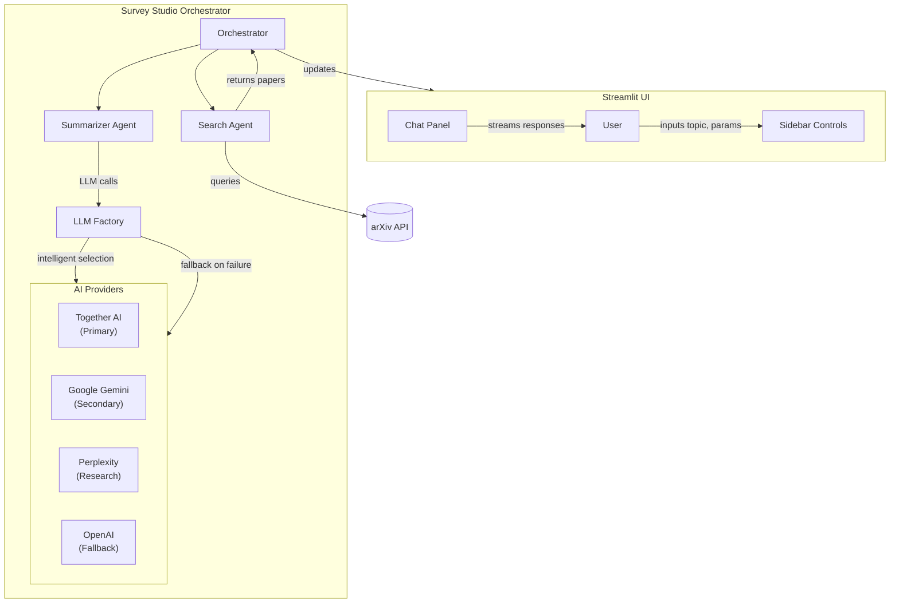

# Survey Studio 📚

A multi-agent literature review assistant powered by AutoGen and Streamlit. Survey Studio uses AI agents to automatically search arXiv, analyze research papers, and generate comprehensive literature reviews.

[](https://www.python.org/downloads/release/python-31211/)
[](https://python-poetry.org/)
[](https://docs.astral.sh/ruff/)
[](https://github.com/microsoft/pyright)
[](https://github.com/Aditya-gam/survey-studio/actions)
[](LICENSE)
[](https://commitizen-tools.github.io/commitizen/)

## 🌟 Features

- **Multi-Agent System**: Two specialized AI agents work together:
  - **Search Agent** 🔍: Crafts optimized arXiv queries and retrieves relevant papers
  - **Summarizer Agent** 📝: Generates structured literature reviews with key insights
- **Multi-Provider AI Support**: Intelligent fallback across 4 AI providers:
  - **Together AI** - Cost-effective with generous free tier
  - **Google Gemini** - Fast and capable for complex analysis
  - **Perplexity** - Research-focused with web access
  - **OpenAI** - Reliable fallback with consistent performance
- **Cost Optimization**: Automatic provider selection based on cost efficiency and availability
- **Usage Monitoring**: Track API usage, costs, and performance across all providers
- **Interactive Web Interface**: Clean, professional Streamlit UI with real-time conversation streaming
- **arXiv Integration**: Direct access to the world's largest repository of academic papers
- **Configurable**: Adjustable number of papers, AI models, and search parameters
- **Professional Development Setup**: Full CI/CD pipeline with linting and type checking

## 🧭 Architecture



- **Streamlit UI**: Collects user input, renders agent conversation and results.
- **Search Agent**: Generates and executes arXiv queries.
- **Summarizer Agent**: Produces structured review using AI models.
- **LLM Factory**: Intelligently selects and manages AI providers with fallback.
- **Orchestrator**: Manages the multi-agent loop and data flow.

## 🖼 Screenshots & Media

- Placeholder: Streamlit sidebar and chat view (add screenshots here)
- Placeholder: End-to-end GIF of literature review workflow

## 🚀 Quick Start

### Prerequisites

- Python 3.12.11+
- Poetry (for dependency management)
- OpenAI API key

### Installation

1. **Clone the repository:**
   ```bash
   git clone https://github.com/Aditya-gam/survey-studio.git
   cd survey-studio
   ```

2. **Install dependencies with Poetry:**
   ```bash
   poetry install
   ```

3. **Set up environment variables:**

   **Option A: Using .env file (Recommended for local development):**
   ```bash
   # Copy the template and add your API key
   cp .env.example .env
   # Edit .env and add your actual OpenAI API key
   ```

   **Option B: Using environment variable:**
   ```bash
   export OPENAI_API_KEY="your-openai-api-key-here"
   ```

4. **Run the application:**
   ```bash
   poetry run streamlit run streamlit_app.py
   ```

The application will open in your browser at `http://localhost:8501`.

### AI Provider Configuration

Survey Studio supports multiple AI providers with intelligent fallback and cost optimization:

**Supported Providers (in priority order):**
1. **Together AI** - Best free tier, cost-effective for general tasks
2. **Google Gemini** - Fast and capable for complex analysis
3. **Perplexity** - Best for research with web access capabilities
4. **OpenAI** - Reliable fallback with consistent performance

**Configuration Options:**

**For Local Development:**
- **`.env` file (Recommended)**: Copy `.env.example` to `.env` and add your API keys
- **Environment variables**: Set API keys in your shell

**For Production/Deployment:**
- **Streamlit Community Cloud**: Use the Secrets tab in the app settings
- **Other platforms**: Set the API key environment variables

**Required API Keys (at least one):**
- `TOGETHER_AI_API_KEY` - Get from [Together AI](https://api.together.xyz/settings/api-keys)
- `GEMINI_API_KEY` - Get from [Google AI Studio](https://aistudio.google.com/app/apikey)
- `PERPLEXITY_API_KEY` - Get from [Perplexity](https://www.perplexity.ai/settings/api)
- `OPENAI_API_KEY` - Get from [OpenAI Platform](https://platform.openai.com/api-keys)

**Optional Model Overrides:**
You can override the default models for each provider:
- `TOGETHER_AI_MODEL` - e.g., `meta-llama/Llama-3.1-70B-Instruct-Turbo`
- `GEMINI_MODEL` - e.g., `gemini-1.5-pro`
- `PERPLEXITY_MODEL` - e.g., `llama-3.1-sonar-huge-128k-online`
- `OPENAI_MODEL` - e.g., `gpt-4o`

The app automatically loads secrets in this priority order:
1. Environment variables (highest priority)
2. `.env` file (for local development)
3. Streamlit secrets (for hosted deployment)

**Intelligent Fallback:**
- Automatically selects the best available provider based on cost efficiency
- Falls back to alternative providers if the primary one fails
- Tracks usage and costs for all providers
- Optimizes for both performance and cost-effectiveness

### Deploy to Streamlit Community Cloud

1. Push the repository to GitHub.
2. Go to Streamlit Community Cloud and create a new app from the repo.
3. Set `OPENAI_API_KEY` in the app Secrets.
4. Deploy. The app will build with Poetry and start automatically.

### Local Port Configuration

Specify a custom port if 8501 is busy:

```bash
poetry run streamlit run streamlit_app.py --server.port 8502
```

## 🛠 Development Setup

### Initial Setup

1. **Install Poetry** (if not already installed):
   ```bash
   curl -sSL https://install.python-poetry.org | python3 -
   ```

2. **Clone and install dependencies:**
   ```bash
   git clone https://github.com/Aditya-gam/survey-studio.git
   cd survey-studio
   poetry install
   ```

3. **Install pre-commit hooks:**
   ```bash
   poetry run pre-commit install
   ```

4. **(Optional) Prime hook environments:** this can speed up the first commit
   ```bash
   poetry run pre-commit install --install-hooks
   ```

### Development Workflow

1. **No venv activation required (use Poetry runner):**
   ```bash
   # Prefer prefixing commands with 'poetry run'
   poetry run <command>
   ```

2. **Run the development server (custom port optional):**
   ```bash
   poetry run streamlit run streamlit_app.py --server.port 8501
   ```


4. **Run linting and formatting:**
   ```bash
   poetry run ruff check .
   poetry run ruff format .
   ```

5. **Type checking:**
   ```bash
   poetry run pyright
   ```

6. **Pre-commit: run the full code quality pipeline locally:**
   ```bash
   poetry run pre-commit run --all-files
   ```
   - Runs in this order: detect-secrets → repo hygiene checks → ruff-format → ruff (with --fix) → pyright → poetry-check → poetry-lock
   - Commit message validation (Commitizen) runs on `commit-msg` and is enforced during `git commit`

### Code Quality Pipeline

The project enforces 100% compliance via Ruff, Pyright, detect-secrets, and commit message validation.

- **Ruff formatting**: opinionated code formatting. Imports sorted with isort profile.
- **Ruff linting**: rule sets enabled: E,W,F,I,B,C4,UP,N,SIM,TCH,ARG,PIE,PT,RET,SLF,TID,ERA,PL.
- **Type checking (Pyright)**: strict configuration; comprehensive type checking with Microsoft's Pyright.
- **Secrets scanning**: `detect-secrets` with a committed baseline.
- **Commit messages**: Conventional Commits validated by Commitizen.
- **Poetry checks**: validates project metadata and lock consistency.

Per-file ignores are configured to reduce noise:
- `__init__.py`: ignore `F401` (re-export patterns)

### Secrets Scanning

- Baseline file: `.secrets.baseline` (committed)
- Update baseline after meaningful changes:
  ```bash
  poetry run detect-secrets scan > .secrets.baseline
  git add .secrets.baseline
  git commit -m "chore(security): update detect-secrets baseline"
  ```

### Commit Messages (Conventional Commits)

- Use Commitizen to guide commit messages:
  ```bash
  poetry run cz commit
  ```
- Validate an existing message:
  ```bash
  poetry run cz check --message "feat: add new exporter"
  ```

### Troubleshooting

- **Poetry not found / path issues**:
  - Install: `curl -sSL https://install.python-poetry.org | python3 -`
  - Ensure Poetry is on PATH. On macOS (zsh): add `export PATH="$HOME/.local/bin:$PATH"` to `~/.zshrc`.
- **Python 3.12.11 not available**:
  - Install via `pyenv`: `pyenv install 3.12.11 && pyenv local 3.12.11`
  - Recreate env: `poetry env use 3.12 && poetry install`
- **Dependency resolution failures**:
  - `poetry lock --no-update` then `poetry install --sync`
  - Clear cache: `poetry cache clear pypi --all`
- **Streamlit port already in use**:
  - Run on a new port: `poetry run streamlit run streamlit_app.py --server.port 8502`
  - Or set in `.streamlit/config.toml` under `[server] port = 8502`
- **OpenAI API key not detected**:
  - Ensure `OPENAI_API_KEY` is exported in your shell profile and available to the app
  - For Streamlit Cloud, set in app Secrets
- **Pyright missing imports**:
  - Add stubs or packages to Pyright configuration in `pyproject.toml`
- **Pre-commit keeps changing files**:
  - Run `poetry run ruff format .` then `poetry run pre-commit run --all-files`
- **Commit message rejected** (Conventional Commits):
  - Use Commitizen: `poetry run cz commit`

### CI Validation Locally

You can simulate the GitHub Actions workflow locally using `act`:

```bash
# Install act (macOS with brew)
brew install act

# Run the CI workflow locally (uses default container runners)
act -j lint
act -j type
```

Common CI issues and resolutions:
- Missing Poetry: ensure the workflow installs the pinned Poetry version.
- Pyright import errors: add stubs or dependencies under Pyright configuration in `pyproject.toml`.
- **Secrets false positives**: update the baseline after verifying the match is benign.

### Hook Order and Idempotency

- Hooks are ordered to auto-fix first, then validate. A second run of `pre-commit run --all-files` should produce no changes.


### Project Structure

```
survey-studio/
├── src/
│   └── survey_studio/
│       ├── __init__.py          # Package initialization
│       ├── app.py              # Streamlit frontend
│       └── backend.py          # AutoGen multi-agent backend
├── .streamlit/
│   └── config.toml            # Streamlit configuration
├── .github/
│   └── workflows/             # CI/CD workflows
├── pyproject.toml             # Poetry configuration
├── .pre-commit-config.yaml    # Pre-commit hooks
├── .gitignore                 # Git ignore rules
├── CHANGELOG.md               # Project changelog
├── README.md                  # This file
└── streamlit_app.py          # Entry point
```

## 📖 Usage

### Web Interface

1. Launch the Streamlit app
2. Enter your research topic in the sidebar
3. Adjust the number of papers (1-10)
4. Select the AI model
5. Click "Start Review" to begin

### Programmatic Usage

```python
import asyncio
from survey_studio import run_survey_studio

async def example():
    async for message in run_survey_studio(
        topic="transformer architectures",
        num_papers=5,
        model="gpt-4o-mini"
    ):
        print(message)

asyncio.run(example())
```

### CI/CD

- GitHub Actions runs two jobs on push/PR: Lint (Ruff) and Type (Pyright).
- Badges: CI appears at the top of this README.

## 📋 Configuration

### Environment Variables

- `OPENAI_API_KEY`: Your OpenAI API key (required)

### Streamlit Configuration

The `.streamlit/config.toml` file contains UI theme and server settings.

### CI/Codecov Setup

1. Ensure required status checks include: `Lint (Ruff)` and `Type Check (Pyright)`.
2. Branch protection: require pull request reviews, dismiss stale approvals on new commits, and enforce linear history (rebase merges).

## 🤝 Contributing

1. Fork the repository
2. Create a feature branch: `git checkout -b feat/amazing-feature`
3. Make your changes
4. Run linting: `poetry run ruff check .`
5. Commit your changes: `git commit -m 'feat: add amazing feature'`
6. Push to the branch: `git push origin feature/amazing-feature`
7. Open a Pull Request (rebase merge strategy, no merge commits). See `CONTRIBUTING.md` for details.

### Commit Convention

This project uses [Conventional Commits](https://www.conventionalcommits.org/):

- `feat:` New features
- `fix:` Bug fixes
- `docs:` Documentation changes
- `style:` Code formatting
- `refactor:` Code refactoring
- `chore:` Build process or tooling changes

## 📊 Technology Stack

- **Backend**: AutoGen (multi-agent framework)
- **Frontend**: Streamlit (web interface)
- **Data Source**: arXiv API
- **AI Models**: OpenAI GPT (configurable)
- **Development**: Poetry, Ruff, Pyright
- **CI/CD**: Pre-commit hooks, GitHub Actions

## 📄 License

This project is licensed under the MIT License - see the [LICENSE](LICENSE) file for details.

## 🙏 Acknowledgments

- [AutoGen](https://github.com/microsoft/autogen) for the multi-agent framework
- [Streamlit](https://streamlit.io/) for the web interface framework
- [arXiv](https://arxiv.org/) for providing access to academic papers
- [OpenAI](https://openai.com/) for the language models

## 📞 Support

If you have questions or need help:

1. Check the [documentation](https://github.com/Aditya-gam/survey-studio/wiki)
2. Search [existing issues](https://github.com/Aditya-gam/survey-studio/issues)
3. Create a [new issue](https://github.com/Aditya-gam/survey-studio/issues/new)

---

**Survey Studio** - Accelerating research through AI-powered literature reviews ✨
